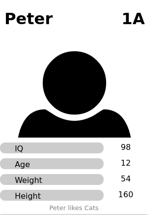

# boulder_card_game
trading card game for my friends

## you can create these nice cards:



with creating a csv with all names, numbers, abilities and a bottom line in folder structure like following:
```
card_games
    - template/
        - output_html/
            - style.css
        - output_png/
        - list_cards.csv
```     
then you can run:

```bash
go run create_card.go card_games/template/list_cards.csv
python convert_crop.py card_games/template
```


